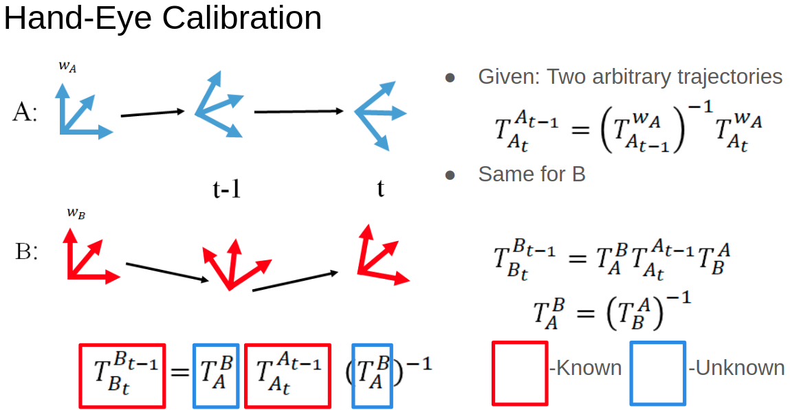
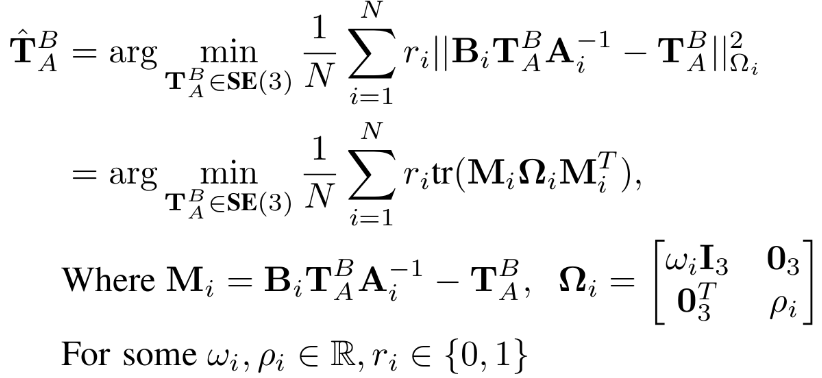

Lidar Calibration Exploratory Tools
===================================

Installation
============

In order to see the cumulative point clouds, you need to install octomap:

```
sudo apt-get install ros-melodic-octomap-server                                                
sudo apt-get install ros-melodic-octomap   
```

We also need the `pcl` library:
```
sudo apt-get install libpcl-dev
sudo apt-get install pcl-tools
```
(This works on Ubuntu 18.04. For older versions other instructions are 
necessary because I don't think `libpcl` was part of the distro repo.

The directory `lidar_pointcloud_analysis` is a ROS package that needs
to be installed in your catkin workspace.

clean\_csvs.py
--------------
Generates csvs for the lidar odometry with sensible header names: `time, x, y,
z, qx, qy, qz, qw`. The pose covariance is represented as `cov_pose_0` through
`cov_pose_35` in row major order (although we are still a little unclear on
the significance of this covariance.

analysis.py
-----------
Formulates and solves an optimization problem to find the maximum likelihood
estimate for the lidar-lidar transform

extract\_pose\_yaml.py
----------------------
Parses the yaml file that stores robot sensor calibration values into
homogeneous transformation matrices.

timing\_analysis.py
-------------------
Runs cross-correlation of angular velocity each each lidar frame to find time
offset between sensors. Based on our preliminary works, there doesn't seem to be
much of an offset.

relative\_pose\_processing.py
-----------------------------

A variety of utility functions to process the data. Includes retiming and
alignment, quaternion multiplication, calculating angular velocity from pairs of
quaternions, and turning the dataframes into lists of relative poses.


Relative Pose Estimation and Analysis
===================

To estimate optimal relative poses between the lidar frames, we use `python` and `pymanopt` for
running iterative gradient-based optimizations to estimate relative pose
transformations that minimize the distance to the observed pose transformations.

### Installation
To install all Python dependencies, you can so with either `conda`  or `pip`:

* **Conda**: `conda env create -f python_env/environment.yml`
* **Pip**: `pip install -r python_env/requirements.txt`

### Hand-Eye Calibration Problem
This manifold optimization framework solves the problem of estimating the relative 
transform between two coordinate systems, i.e. two lidar sensors.  We use the 
framework below to compute an optimal estimate of the relative transform:



Mathematically, this can be computed via the following optimization:


### Running the Analysis
To run this analysis, run: 
```
conda activate darpa_subt  // If using conda environment - else ignore this command 
cd calibration_optimization
python3 analysis.py --weighted --use_xval --reject_threshold 100 --kfolds 10
```
Where the command-line parameters are given by:

1. `weighted`: Whether to use weighted optimization to account for noise in
rotation and translation.

2. `reject_threshold`: Value of maximum ICP diagonal with which to reject a
sample.

3. `kfolds`: If cross-validation is enabled, this is the number of 
cross-validation folds to use for it.

4. `use_xval`: Whether to use cross-validation when fitting the model and 
calculating relative pose estimates.

This will:

1. Estimate the relative pose transformation between:
(i) `velodyne` and `velodyne_front`, (ii) `velodyne` and `velodyne_rear`, and
(iii)) `velodyne_front` and `velodyne_rear`.  These estimates are provided an
initial guess given by the configuration file `husky4_sensors.yaml`, from which
we have extracted relative pose transformations between frames.

2. Save the final estimates of these relative pose transformations, represented
as 4 x 4 matrices, to the directory `calibration_optimization/results/final_estimates_unweighted_{True, False}`,
where the suffix of this directory depends on whether you use weighted estimates
to optimize the system (a flag in `analysis.py`).

3. Compute the Root Mean Squared Error (RMSE) of the relative (i) pose
transformation, (ii) rotation, and (iii) translation.  This is carried out for
both the initial and final estimates.  These results for each pairwise
combination of sensors can be found under `calibration_optimization/results/analysis_results_unweighted_{True,
False}`, again depending on whether or not the samples are weighted during
training.

4. Generate plots of the odometry for all three sensors.  These plots are saved to 
`calibration_optimization/plots/`.

5. Generate plots of the ICP covariance diagonal elements over time for each
sensor.  These are saved in `calibration_optimization/plots/icp_plots/` 
(or `calibration_optimization/plots/icp_plots_clipped`), if the
maximum value is clipped.

6. If cross-validation is enabled, the results will be stored in a new (or
existing) directory given by `calibration_optimization/results/cross_validation_folds=K`, where `K` is the
number of folds.

Utility functions for running the script in `analysis.py` can be found in
`calibration_optimization/analysis_utils.py`.

Point Cloud Validation
======================


Running
-------
Currently, the package is set up to specifically three lidar bags at a time.
The `runbags.launch` file will launch three bags, assumed to be from main,
front, and rear lidar. It also sets up static transform publishers based on the
hand-tuned calibration from JPL. After running this, it should be possible to
visualize the lidar scans in `rviz`. It also starts an octomap server for each
lidar, which can also be visualized in `rviz`.

The following scripts are built by the ROS package:

save\_octomap\_cloud
--------------------
While visualizing live data in ROS can be nice, we have found it useful to save
the data outside of ROS to allow for repeatable and batch processing. This
utility will save the current octomaps to `.pcd` files (which can easily be
loaded into `PCL`.

ros\_to\_pcds
-----------------

This utility saves each individual point scan from a lidar to a `.pcd` file.
This is useful if you want to load the lidar scans directly into `PCL` and don't
want to have to keep dealing with ROS. Currently configured to save scans from
each lidar at 2 hz. Also saves the pose of the main lidar at each time step, so
that the lidar scans can all be put back into the same "global" reference frame.


build\_for\_analysis
--------------------
Builds a point cloud consisting of many individual scans. Performs voxel
downsampling. Currently an issue with the PCL library limits the voxel
resolution. It's about 5cm on this dataset, but may be larger or smaller on
other datasets (it's related to the bounding box volume of the data I believe).

build\_perturbed
----------------
Utility to test the point cloud consistency of slightly perturbed lidar
calibrations. Generates slight rotation perturbations to the calibration matrix.
The resulting evaluation of point cloud error is performed by the next utility. 

analyze\_perturbed
------------------
See above for documentation on this file.


analyze\_single
---------------
Evaluate the point cloud consistency between point clouds. Ideally, this
function should be improved to use feature-based point cloud matching instead
of naive point-point distances. 


Octomap / PCL Tools
===================

Running `rosrun final save_octomap_cloud` generates three point clouds, one for
each lidar. These are called `pc_main.pcd, pc_front.pcd` and `pc_rear.pcd`.  We
can visualize these point clouds with `pcl_viewer` with the command:
```
pcl_viewer -multiview 1 pc_main.pcd pc_front.pcd pc_rear.pcd
```
or
```
pcl_viewer pc_main.pcd pc_front.pcd pc_rear.pcd
```
The former command displays the clouds separately, and the latter displays them
on top of each other.


Technical Details
---------------
If you're interested in any of the technical details behind this framework, 
please take a look at our **slide deck** in `slide_deck.pdf` and our **paper**
in `paper.pdf`.


Acknowledgements
---------------
We would like to thank Professor Luca Carlone and the VNAV staff for support on 
this project.  Additionally, we thank Benjamin Morrell and Fadhil Ginting for 
providing data and introducing us to the DARPA Sub-T challenge.  Finally, we 
would like to thank Mike Schoder and Phil Cotter for collaborating and 
coordinating with us on this project.
